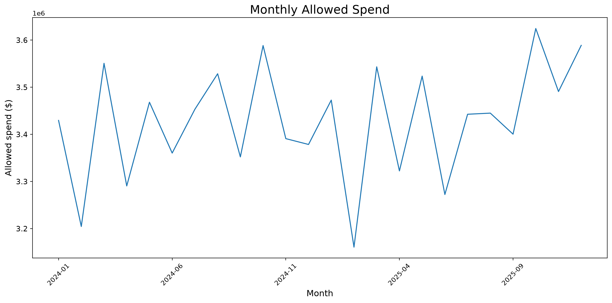
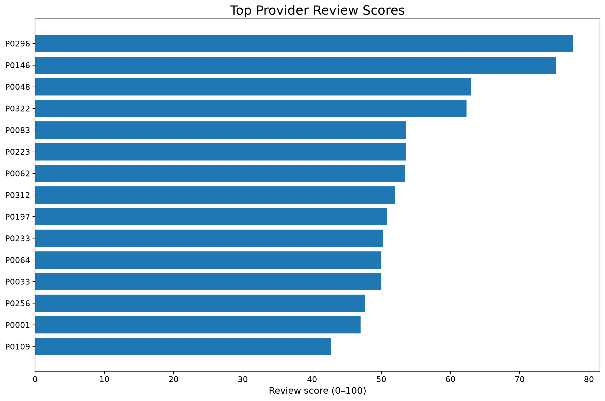
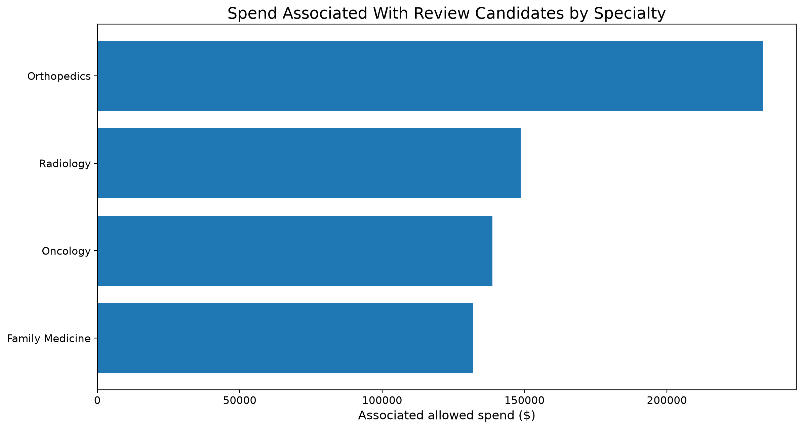
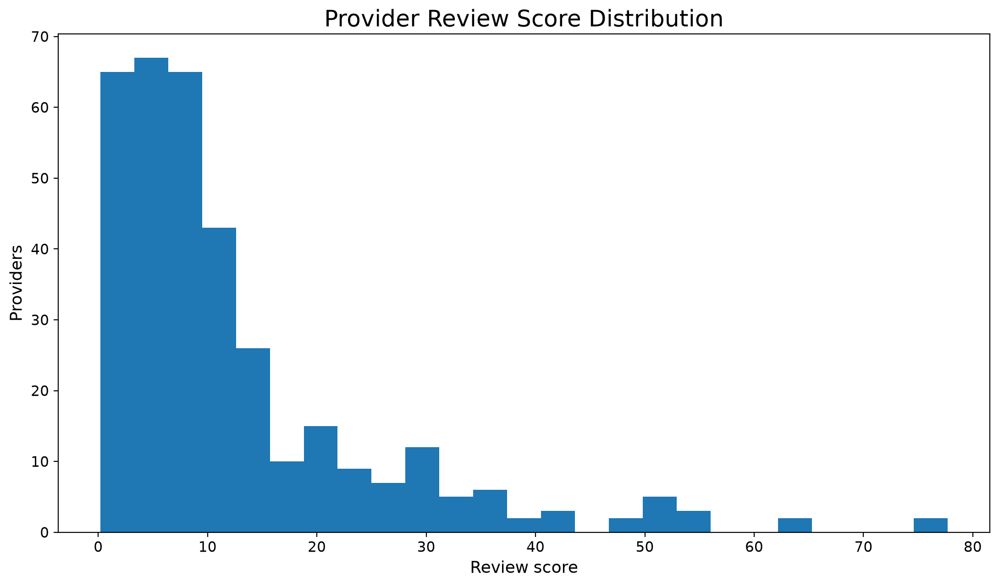

# Healthcare Claims Waste & Cost Intelligence Platform

[](https://github.com/anikethperuri7/healthcare-claims-intelligence/actions/workflows/ci.yml)


An end-to-end healthcare analytics project that models a payer-style claims workflow: generate realistic **synthetic claims**, load them into a **relational SQL database**, compute financial and utilization KPIs, benchmark providers against comparable peers, detect abnormal billing/utilization patterns, create an **explainable 0–100 review score**, estimate dollars associated with review candidates, and export curated tables for a **Power BI investigation dashboard**.

> **Portfolio objective:** demonstrate how SQL, Python, analytics, anomaly detection, and BI can work together to turn raw healthcare claims into a prioritized, explainable investigation workflow.

> **Important:** this project does **not** determine fraud. Scores identify synthetic records with unusual patterns that may warrant review. Real fraud/waste/abuse investigations require clinical context, coding expertise, policy rules, contractual knowledge, and human review.

All data in this repository is **fully synthetic** and generated by code. No real member, provider, claim, diagnosis, or organization data is used.

## Business question

> **Out of 100,000+ healthcare claims, where are potentially abnormal utilization and billing patterns occurring, how much spending is associated with those patterns, and what should an analyst investigate first?**

The project is designed around four analyst decisions:

1. **Where is spending concentrated?**
2. **Which providers differ materially from comparable peers?**
3. **Which patterns are unusual enough to prioritize for review?**
4. **How much financial exposure is associated with those review candidates?**

## Why this is more than a dashboard

The pipeline intentionally separates data generation, SQL storage, quality validation, feature engineering, anomaly detection, scoring, evaluation, reporting, and BI export:

```text
Synthetic members / providers / procedures / claims
                    ↓
           Relational SQLite warehouse
                    ↓
      SQL KPIs + peer benchmark queries
                    ↓
       Data quality + feature engineering
                    ↓
 Robust statistics + Isolation Forest + change detection
                    ↓
        Explainable provider review scoring
                    ↓
 Evaluation against hidden synthetic scenario labels
                    ↓
 Investigation queue + financial exposure analysis
                    ↓
        Power BI-ready star-schema exports
                    ↓
 Executive report + high-resolution visualizations
```

## Key capabilities

| Capability | What the project demonstrates |
|---|---|
| Relational data model | Members, providers, procedures, diagnoses, claims, and review ground truth |
| SQL analytics | CTEs, window functions, aggregations, peer ranking, temporal comparisons, and investigation queries |
| Data quality | Null, duplicate, referential-integrity, negative-value, and date-consistency checks |
| Provider peer benchmarking | Specialty-aware comparisons rather than comparing unlike providers |
| Feature engineering | Cost, frequency, duplicate-pattern, utilization, coding-mix, and temporal-change features |
| Multi-method anomaly detection | Robust z-scores, Isolation Forest, and sudden-change signals |
| Explainable scoring | 0–100 review score plus human-readable reasons for each high-priority provider |
| Synthetic validation | Known injected review scenarios are held out from features and used only to evaluate detection quality |
| Financial impact | Dollars associated with review candidates and prioritized investigation queues |
| Power BI handoff | Dashboard-ready fact/dimension tables, KPI exports, and documented DAX measures |
| Engineering quality | CLI, automated tests, reproducible data generation, linting, formatting, and GitHub Actions CI |

## Example generated output

The bundled example starts with **120,000 base synthetic claims** and, after injected review scenarios, produces **120,825 claims**, **6,000 members**, and **349 providers** over a two-year period. Run the pipeline with seed 42 to regenerate the example outputs.

Generated artifacts include:

- `reports/latest/report.md` — executive-style findings and methodology summary
- `reports/latest/provider_investigation_queue.csv` — prioritized providers with scores, reasons, and associated spend
- `reports/latest/claim_review_queue.csv` — claim-level review candidates
- `reports/latest/model_evaluation.json` — precision/recall metrics against synthetic scenario labels
- `reports/latest/charts/` — high-resolution 200-DPI charts
- `reports/latest/dashboard_exports/` — curated Power BI tables
### Generated visualizations

#### Monthly Allowed Spend


#### Top Provider Review Scores


#### Review-Candidate Spend by Specialty


#### Provider Review Score Distribution



## Quickstart

```bash
python -m venv .venv
# Windows: .venv\Scripts\activate
# macOS/Linux: source .venv/bin/activate

pip install -e ".[dev]"
python scripts/run_pipeline.py --claims 120000 --seed 42
```

Or use the CLI:

```bash
claims-intel run --claims 120000 --seed 42 --output-dir reports/latest
```

The pipeline will:

1. generate synthetic source tables,
2. build `data/generated/claims_intelligence.sqlite`,
3. run data-quality checks,
4. calculate provider and claim features,
5. score review candidates,
6. evaluate detection against synthetic ground truth,
7. generate charts and a Markdown report, and
8. export Power BI-ready tables.

## SQL portfolio

The `sql/` folder is deliberately prominent. It contains business-facing queries rather than only DDL:

```text
sql/
├── schema.sql
├── 01_data_quality_checks.sql
├── 02_cost_and_utilization_kpis.sql
├── 03_provider_peer_benchmarks.sql
├── 04_member_utilization.sql
├── 05_temporal_change_detection.sql
└── 06_investigation_queue.sql
```

Examples include specialty-level percentile ranking, provider cost-per-claim benchmarking, rolling-month utilization changes, repeat-service patterns, and financial exposure calculations.

## Power BI Dashboard

The repository includes an interactive Power BI dashboard (`Healthcare_Claims_Intelligence.pbix`) built from the pipeline's curated dashboard exports.

The dashboard contains two focused analysis pages:

1. **Executive Overview** — tracks total claims, allowed and paid spend, unique members, high-priority providers, review-candidate spend, monthly spending trends, specialty-level spending, and top provider review scores. Interactive region and specialty filters support targeted analysis.

2. **Provider Risk & Review Prioritization** — provides a provider-level investigation view with review scores, associated review spend, claim volume, network status, priority bands, and human-readable review reasons. Interactive priority-band and specialty filters help analysts identify providers for further review.

The dashboard complements the Python and SQL workflow by turning the generated analytical outputs into an interactive business intelligence interface for cost monitoring and investigation prioritization.

See `dashboard/POWER_BI_BUILD_GUIDE.md` and `dashboard/DAX_MEASURES.md` for supporting documentation.

## Repository structure

```text
healthcare-claims-intelligence/
├── .github/workflows/ci.yml
├── dashboard/
├── data/
│   ├── sample/
│   └── generated/
├── docs/
│   ├── ARCHITECTURE.md
│   ├── DATA_DICTIONARY.md
│   └── METHODOLOGY.md
├── notebooks/
│   └── exploratory_analysis.ipynb
├── reports/latest/
├── scripts/
│   └── run_pipeline.py
├── sql/
├── src/claims_intelligence/
└── tests/
```

## Methodology and limitations

This is a **portfolio analytics system**, not a production fraud model.

- Synthetic review scenarios are intentionally injected so detection performance can be evaluated. They are not examples of proven real-world fraud.
- Provider comparisons are specialty-aware, but real payer analytics would also risk-adjust for case mix, geography, contracts, patient acuity, and benefit design.
- Isolation Forest is used as an unsupervised anomaly signal, not as proof of wrongdoing.
- Financial exposure represents spending associated with review candidates; it is **not** assumed recoverable savings.
- Claims coding in the synthetic generator is simplified relative to real ICD/CPT/HCPCS structures.
- A production system would require stronger governance, PHI controls, auditability, model monitoring, clinical/coding review, and payer-specific policy logic.

See `docs/METHODOLOGY.md` for full details.

## Author

**Aniketh Peruri**

Built as a healthcare/business analytics portfolio project focused on payer cost intelligence, explainable anomaly detection, and data-driven investigation prioritization.

## License

MIT License. See `LICENSE`.
